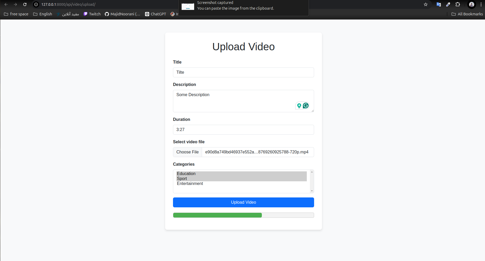
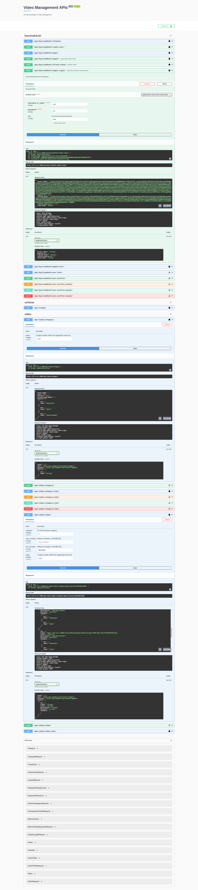

# Video Upload Manager

## How to run:
1. install packages in [requirements.txt](requirements.txt) with

```
pip install -r requirements.txt
```
2. Create database based on the values specified in [.env](.env) file.
3. Go to the app directory
```
cd app
```
4. run  migrations:
```
python manage.py migrate
```

5. run the app
```
daphne -v 2 app.asgi:application
```

## Username and passwords:
1. **Admin**
    * username: admin
    * password: mjhcHt7eFfpAH[;HJmx#
2. **user1 (not admin)**:
    * username: user1
    * password: 1111


**Upload Video page:**
To upload video and check video progress check this address:
http://127.0.0.1:8000/api/video/upload/

username and password is hardcoded in html file because the only purpose of this page is checking the websocket functionality




# The endpoints:

**The swagger page address:**
http://127.0.0.1:8000/api/docs/




## Keycloak

I have created an instance of keycloak on Cloud-IAM and the credentials are in [.env](.env) file.

An app named keycloakAuth is added to the project to handle authentication and authorization.
You can get accesss token from this endpoint: http://127.0.0.1:8000/api/keycloakAuth/simple-login/ and then add it to the endpoints as Bearer Token.